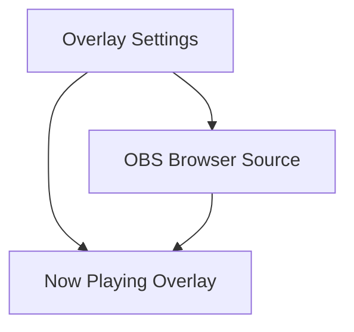

## 1. Product Overview
A lightweight OBS Browser Source overlay that displays Apple Music “Now Playing” information (track, artist, album, artwork, playback state).
It visually matches the existing teewee.live follow/notch overlay (glass pill, Block Script typography, soft shadow, transparent background).

## 2. Core Features

### 2.1 Feature Module
Our overlay requirements consist of the following main pages:
1. **Now Playing Overlay**: on-screen now playing card, state handling, theme matching, sizing.
2. **Overlay Settings**: connection setup to the local data source, appearance controls, preview/test tools.

### 2.2 Page Details
| Page Name | Module Name | Feature description |
|-----------|-------------|---------------------|
| Now Playing Overlay | Data binding | Render current track title, artist, album and artwork from the local “now playing” endpoint; refresh on change. |
| Now Playing Overlay | Playback state | Show “playing/paused/stopped” states; hide or show a fallback message when nothing is playing. |
| Now Playing Overlay | Teewee styling | Match teewee.live notch look: blurred glass pill, rounded corners, subtle border and drop shadow, Block Script headline text, transparent canvas. |
| Now Playing Overlay | Layout & scaling | Maintain a 1920×1080 stage coordinate system and scale to the OBS Browser Source size; support compact (text-only) and full (artwork + text) variants via query params. |
| Overlay Settings | Data source setup | Display the local helper URL/port, connection status, and last update time; allow changing polling interval and enabling WebSocket push if available. |
| Overlay Settings | Appearance controls | Configure mode (compact/full), alignment (left/centre/right), safe margins, and colour intensity while keeping teewee style tokens. |
| Overlay Settings | Preview & test | Provide an in-page preview and a “test payload” button to simulate a track, to validate fonts/positioning in OBS. |

## 3. Core Process
As the streamer, you run a small local helper that can read Apple Music’s current track, then you add a Browser Source in OBS pointing at the overlay URL. The overlay continuously updates as the song changes, and you can use the settings page to confirm connectivity and adjust layout without reworking OBS scenes.

