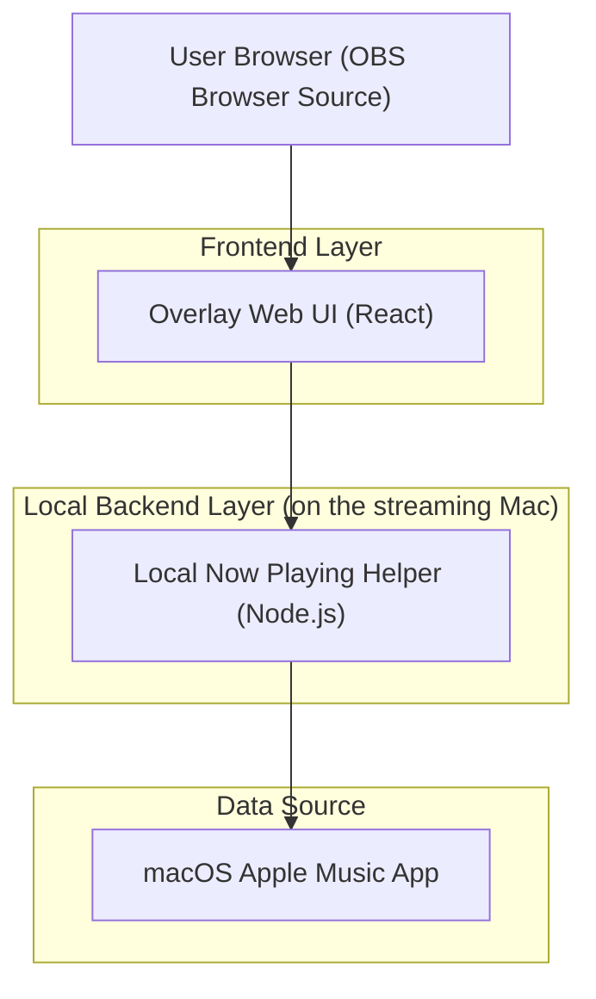
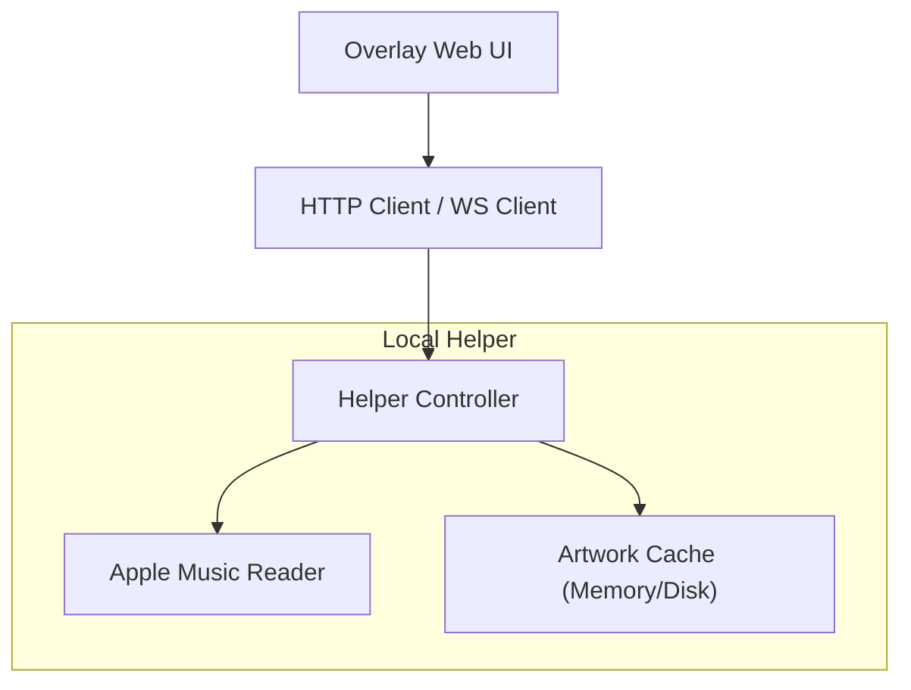

## 1.Architecture design


## 2.Technology Description
The solution is intentionally local-first to avoid API keys and to keep latency low.
- Frontend: React@18 + TypeScript + Vite (or Next.js if you prefer to host alongside teewee.live)
- Backend: Node.js@20 (local helper) + AppleScript execution (macOS)
- Database: None

## 3.Route definitions
| Route | Purpose |
|-------|---------|
| /overlay | OBS-facing overlay page (transparent background, query params for mode/alignment). |
| /settings | Streamer-facing settings and preview page. |

## 4.API definitions (If it includes backend services)
### 4.1 Core API
The overlay consumes a small local HTTP/WebSocket API exposed by the helper.

TypeScript shared types
```ts
export type PlaybackState = 'playing' | 'paused' | 'stopped';

export type NowPlaying = {
  state: PlaybackState;
  title?: string;
  artist?: string;
  album?: string;
  durationMs?: number;
  positionMs?: number;
  artworkUrl?: string; // local URL served by helper
  updatedAt: string; // ISO
};
```

Endpoints
- GET /api/now-playing
  - Returns: NowPlaying
- GET /api/artwork/current
  - Returns: image/* (current artwork) or 404 when unavailable
- WS /ws
  - Pushes: { type: "NOW_PLAYING_UPDATED", payload: NowPlaying }

## 5.Server architecture diagram (If it includes backend services)


## 6.Data model(if applicable)
No persistent database is required. The helper maintains an in-memory “last known track” and optionally a small disk cache for artwork files to provide stable URLs.

### Data acquisition approach
Primary approach (recommended): macOS AppleScript polling or event-like polling.
- The helper periodically executes AppleScript against the “Music” app to read current track metadata (name, artist, album) and playback state.
- Artwork is extracted (when available), saved to a local file, and served via /api/artwork/current.
- Update strategy: poll every ~500–1000ms for state/track changes, then push updates via WebSocket for minimal overlay re-render latency.

### OBS integration options
- Recommended: OBS “Browser Source” pointing to http://127.0.0.1:<port>/overlay (set width/height to 1920×1080; enable “Shutdown source when not visible” if desired).
- Alternative: Host /overlay remotely (e.g., teewee.live) and run the helper as a secure bridge; the overlay connects to the helper via a user-configured WebSocket URL on the local network (only suitable when networking constraints are understood).
